#FSSC Wiki
##Data Server Usage Plots

These are plots of the number of queries to the LAT data server on a daily and monthly basis. They are updated at the start of every day. For more information, see Usage Statistics.

The plots below exclude two days: 2013-08-29 and 2013-08-30. During those days a user's script ran amok, and we ended up with 2,423 queries on 8/29 and 14,340 on 8/30. Since these 8/30 values, in particular, skewed the statistics and plots, they have been left out.

Number of queries per day over the lifetime of the mission (CSV):

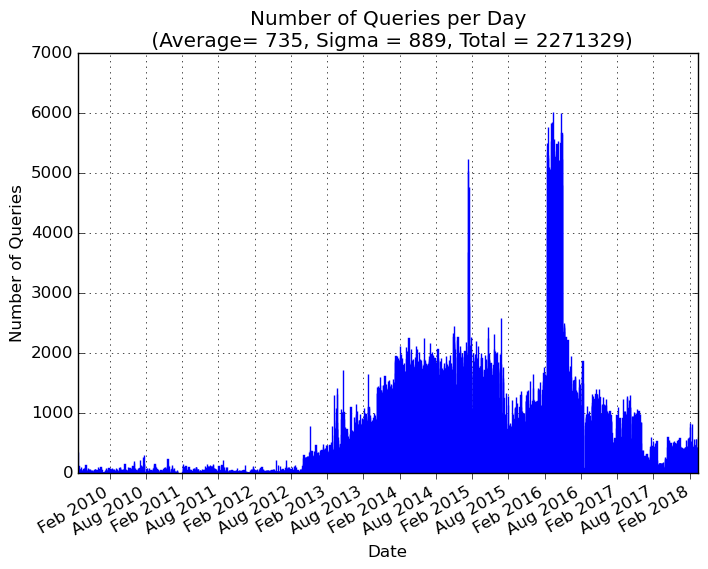

Amount of data downloaded over the life of the mission (CSV):

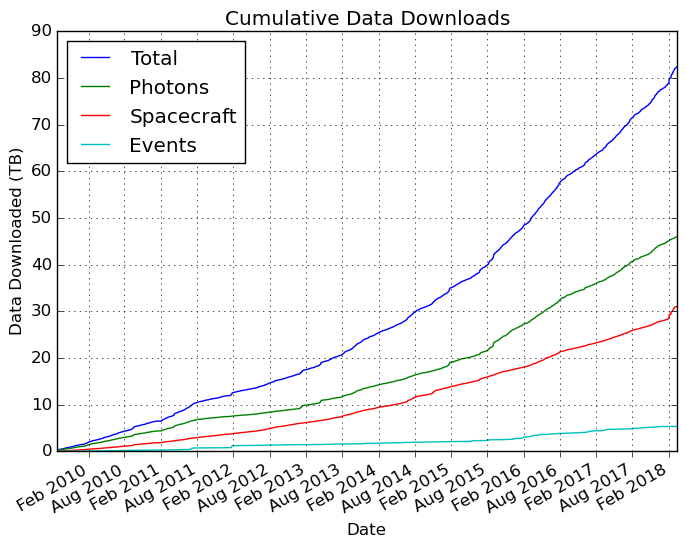

Number of queries per day for the last month (CSV):

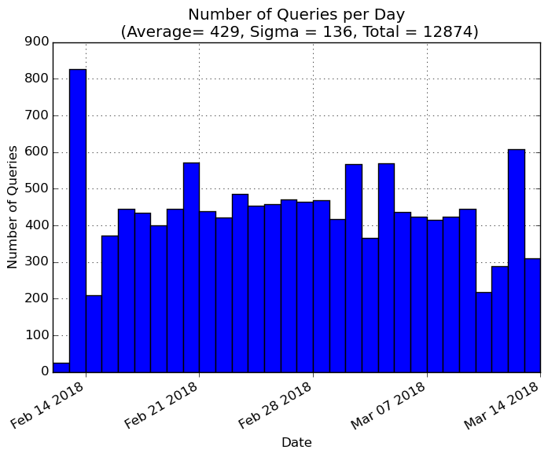

Number of queries per month over the lifetime of the mission (CSV). The dearth of queries in January 2011 was due to the security incident that took the data server offline for most of the month.

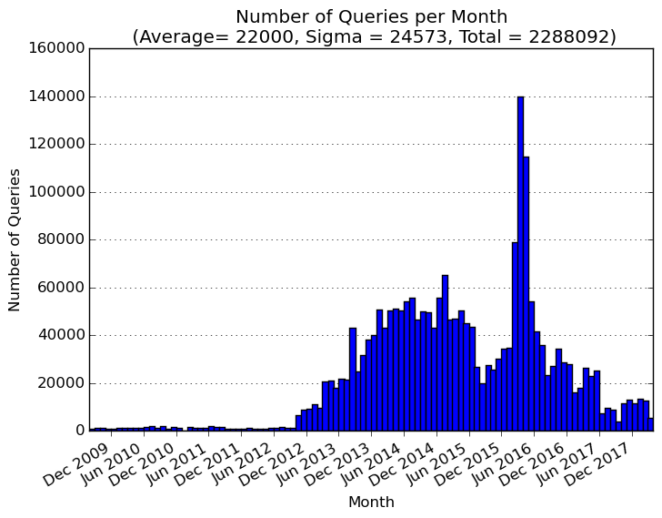

Number of queries per month over the lifetime of the mission (CSV) broken down by IP address. Two IP addresses from IAPS are responsible for the vast majority of queries.

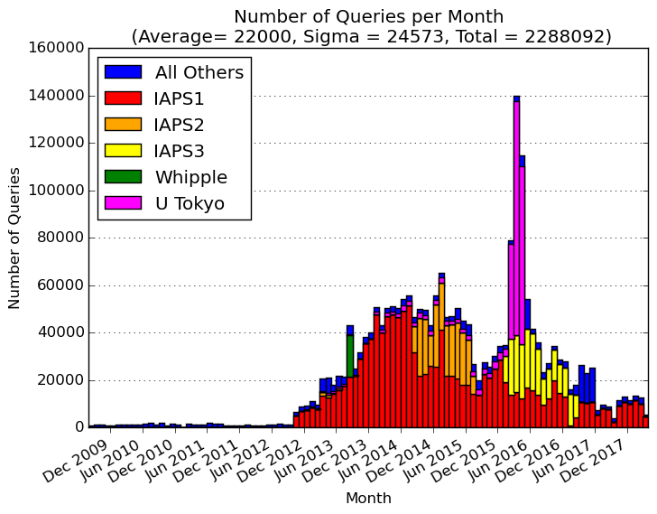

Number of queries per month over the lifetime of the mission (CSV) for each type of LAT data. The dearth of queries in January 2011 was due to the security incident that took the data server offline for most of the month.

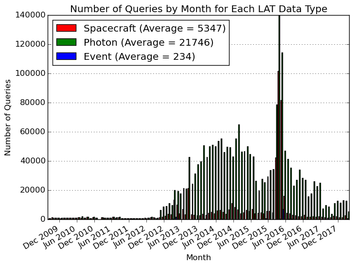

Total number of queries for each day of the week over the life of the mission (CSV):

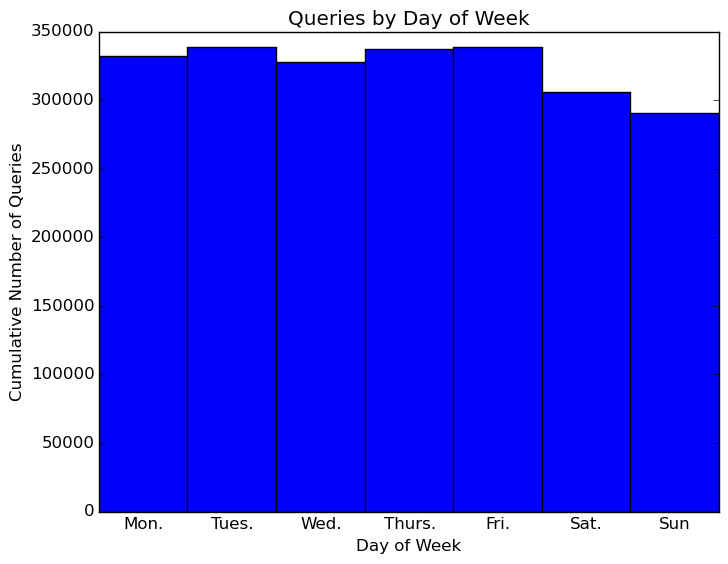

The distribution of requested search radii for queries (CSV). The red bars show the distribution for scripted queries from IAPS, while the blue indicates the total for all queries. The scripted queries are the cause of the large spike at 30 degrees. Note that the y-axis is a log plot due to the overwhelmingly larger number of 30 degree queries. The default search radius is 15 degrees.

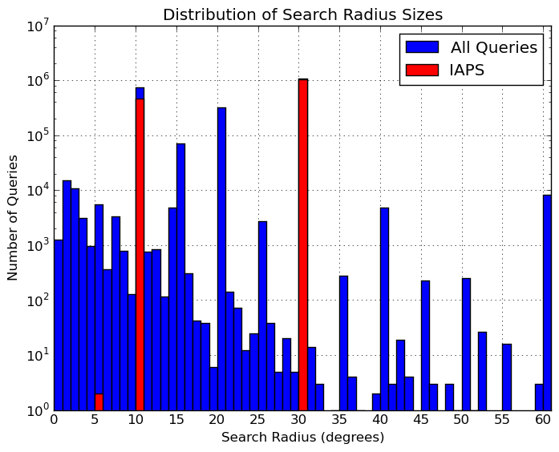

The distribution of requested query lengths in days (CSV). Both axes are log scale. Vertical lines mark peaks at 20 days, 60 days, and 6 months (the default length). The red bars show the distribution for queries from IAPS, while the blue indicates the total for all queries. The scripted queries are general for fixed and short time intervals.

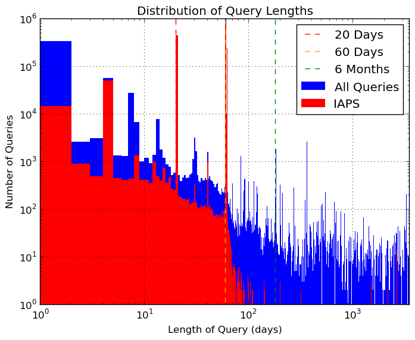

The distribution of requested query lengths scaled to the mission length at the time of the query (CSV). Note that the y-axis is log scale. The red bars show the distribution for queries from IAPS, while the blue indicates the total for all queries. In general, this shows that scripted queries are for short times and that many people ask for data over the whole mission.

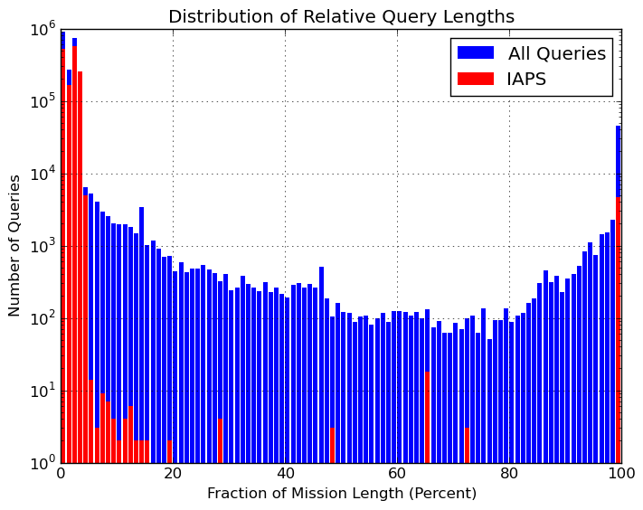

Below is the distribution of the requested queries on the sky plotted in galactic coordinates on top of the 5-year Fermi sky map (Aitoff projection). Each query is represented by a single point. Green points are IAPS queries while cyan points are all other queries. You can see the density of queries along the galactic plane as well queries that trace the ecliptic (yellow) and celestial equator (magenta).

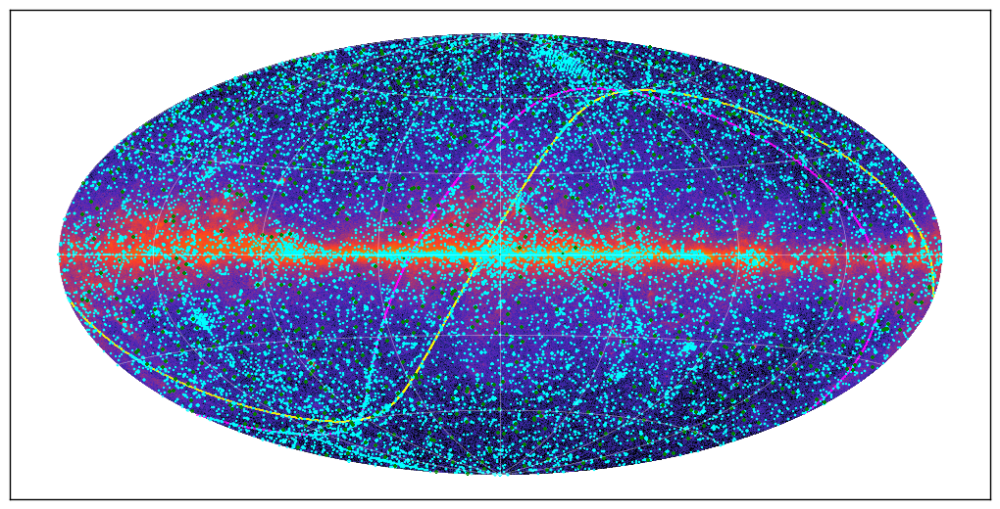

The galactic query distribution as above but binned into 1 degree pixels weighted by the length of the requested query, smoothed with a Gaussian, and displayed as logarithmic scaled contours on the Fermi 5-year sky map. Some source names are marked.

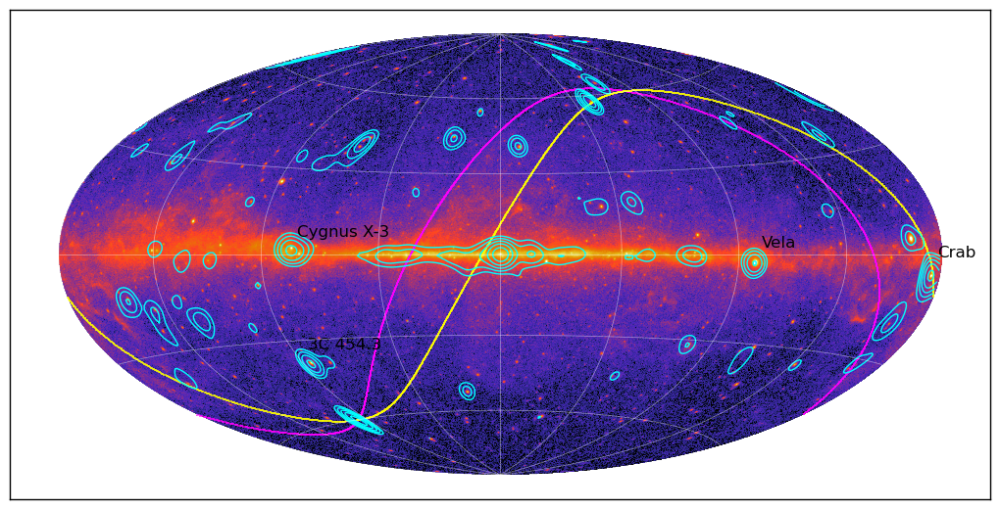

The distribution of queries as above but centered on the galactic anti-center and plotted on top of a Fermi 6 month image.

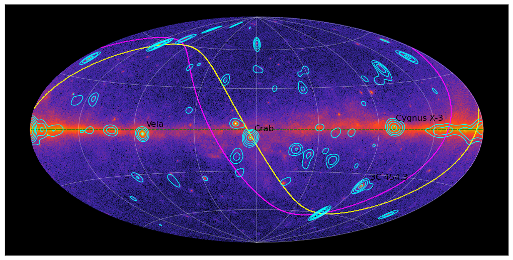

Below is the distribution of the requested queries on the sky plotted in equatorial coordinates (Aitoff projection) on top of a Fermi 6 month sky image centered at RA=0 and Dec=0. The galactic plane is indicated in magenta and the ecliptic in yellow.

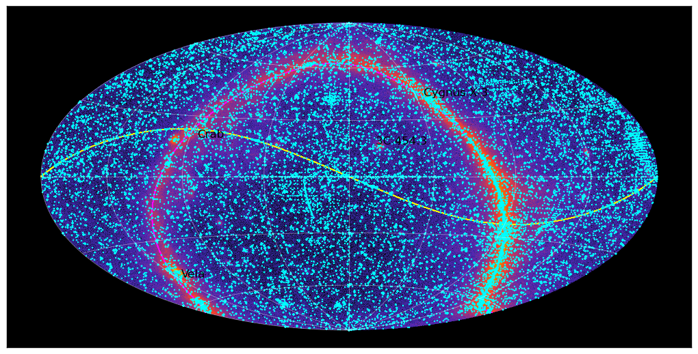

The query contours as above placed over the equatorial coordinate image.

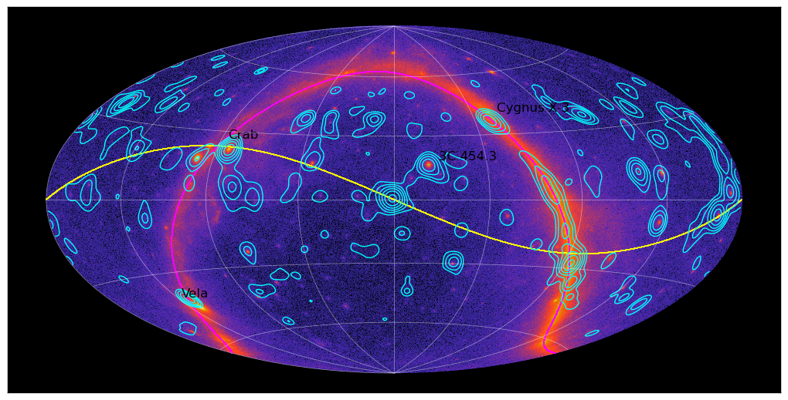

Similar to the first contour plot, this shows the galactic query distribution binned into 1 degree pixels, smoothed with a Gaussian, and displayed as logarithmic scaled contours on the Fermi 5-year sky map. However, the weights are inverted, so short queries are weighed more heavily.

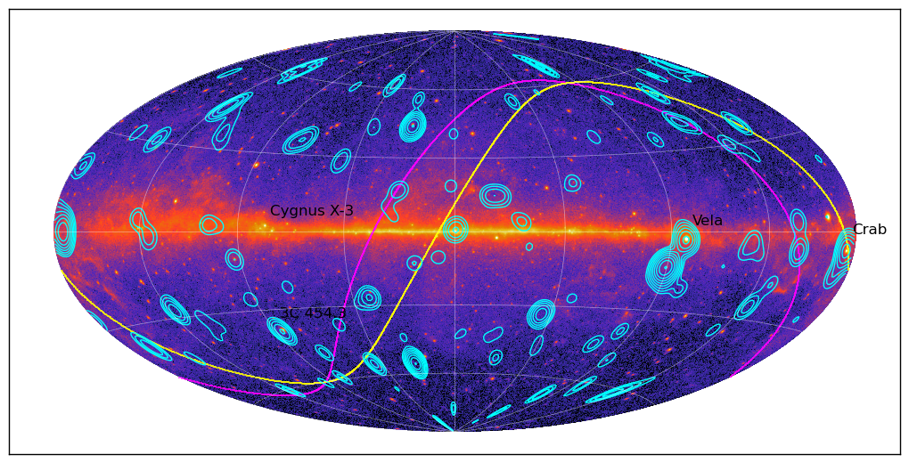

